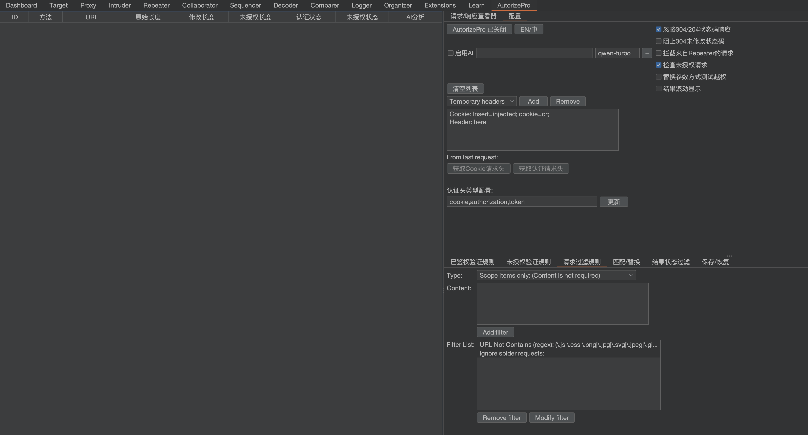
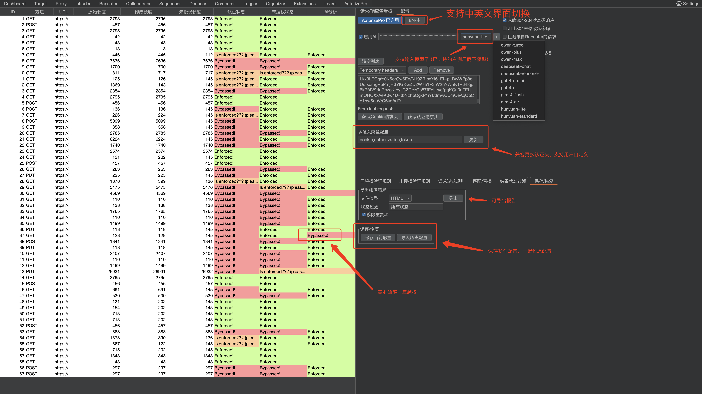
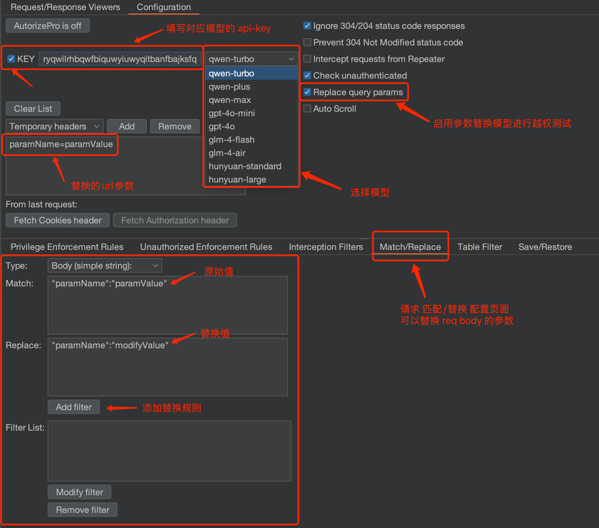

- [English README IS HERE](https://github.com/sule01u/AutorizePro/blob/master/README_en.md)

# 🧿 AutorizePro (内置AI分析模块 ❤️‍🔥):  
### 一句话介绍工具： AutorizePro 是一款创新性的内置AI分析模块的专注于越权检测的 Burp 插件 (已有多个白帽反馈用工具嘎嘎挖到src洞,  欢迎Star🌟持续跟踪项目最新版本功能)
> **🟣️ 未启用 AI 时为常规检测逻辑，AI 为可选项。面对复杂多变的接口响应，启用 AI 可以大幅提升效率与准确率。时间宝贵，让 AI 替你十倍速挖洞！**

### 工具背景
- **越权漏洞是黑盒测试与 SRC 挖掘中必测项，但手工逐个验证耗时巨大。**
- **传统越权检测工具难以自动化覆盖多样化接口逻辑，误报率高，实用性弱。**

### 工具亮点
- **内置 AI 分析模块(可选项) ，将工具原始误报率从 95% 降低至 5% ，从大量误报分析中解脱出来**
- **保密性：支持配置为公司内部部署模型进行分析**
- **工具默认排除静态资源、html页面、错误状态码等非接口资源，无需人工配置**
- **支持导出越权测试报告，支持html、csv格式**
- **工具日志可查看每个接口 AI 判定的原因，方便反馈调优**

## 🔧 安装AutorizePro
### 1️⃣ 下载 Burp Suite 和 Jython

    1. 下载 Burp Suite：https://portswigger.net/burp/releases
    2. 下载 Jython standalone JAR 文件：https://www.jython.org/download.html

### 2️⃣ 配置 Burp Suite 的 Python 环境

	1. 打开 Burp Suite
	2. 导航到 Extender -> Options
	3. 在 Python Environment 部分，点击 Select File
	4. 选择你刚刚下载的 Jython standalone JAR 文件 (本项目测试环境为: jython 2.7.3, burp suite 2024.11（自带的java版本为java22）)

### 3️⃣ 安装 AutorizePro 插件
	1. 下载代码仓库最新版本的发布zip包到本地，解压
	2. 打开 Burp Suite，导航到 Extender -> Extensions -> Add
	3. 在 Extension Type 选择框中，选择python
	4. 在 Extension file 选择框中，选择代码仓库中 AutorizePro.py 文件路径 (注意路径不能有中文，否则安装失败)

### AutorizePro 插件安装完成界面 🎉
> 💡 你可通过拉动中间的侧边栏任意调整展示页和配置页的显示比例；配置界面可通过上下拉动分界线任意调整配置页面比例；

## 🔫 使用 AutorizePro 插件
    1. 打开配置选项卡：点击 AutorizePro -> Configuration。
    
    2. 将第二个账户认证头复制到标有 “Insert injected header here” 的文本框中。注意：如果请求中已经包含了该头部，插件会替换现有的头部，否则会添加新头部。
    
    3. 如果不需要进行未授权的测试（即不带任何 cookie 的请求），可以取消勾选 Check unauthenticated (默认开启未授权检测)。
    
    4. 选择模型，填写对应API Key 后，勾选复选框则启用 AI 分析，结果将展示在左侧 AI. Analyzer 列。
    
    5. 点击 AutorizePro is off 按钮启用插件，即可开始测试。
    
    6. 在 AutorizePro 插件的左侧结果展示界面中，你将看到请求的 URL 和 对应的权限检查状态。
    
    7. 点击左侧展示页面的某个 URL，点击右侧 Request/Resppnse Viewers Tab页，即可查看选中项的 原始 && 越权 && 未授权 测试的请求/响应，可人工查验。

###  🌠 使用效果示例
>  🌟 大幅降低误报: 从下图中可以看出，启用AI分析后，你只需要去分析一个请求是否真正越权，人工投入的分析精力节约95%以上。

> ⬇️ 替换cookie方式测试越权

> ⬇️ 替换参数方式测试越权

> 查看选中条目的具体请求信息，可同时展示越权请求、原始请求、未授权请求，方便对比差异

### ❓检测状态说明
- **Bypassed! (红色) : 判定越权**

- **Enforced! (绿色) : 判定不存在越权**

- **Is enforced???: 无法判断，可以在 enforcement detector/已鉴权规则 中配置越权特征协助判断**

### 🚰 过滤器配置：在 Interception Filters/ 请求过滤规则 中配置拦截规则
- 拦截过滤器位可以配置插件 需要拦截哪些域名 或 拦截符合指定特征的请求。
- 支持黑名单、白名单、正则表达式或 Burp 的范围内的项目来确定拦截的范围，以避免不必要的域名被 AutorizePro 拦截，避免对无关请求的拦截分散分析精力。
- ⚠️ **安全提示：因为工具涉及cookie替换重放，强烈建议 在 Interception Filters 指定目标的站点，以免cookie泄漏至其他站点**
- 🌟 工具默认忽略静态资源、html、错误响应等类型请求的分析，无需用户配置。

##  💰 AI分析功能需要花多少钱？(需勾选复选框之后才会启用AI分析)
- 启用AI分析之后仅自动检测 (状态码相等 && 响应为json格式 && 响应长度在50-6000 的数据包)，减少不必要的AI分析带来的经费消耗。
-  ⚠️ 注意：当启用AI分析功能时，您应该尽量在 Interception Filters 中配置拦截的 域名 / 规则，以免检测非目标站点带来的经费消耗。
- 🌟 支持多家厂商模型接入，要使用其他模型，请自行开通对应的服务以及申请API KEY，使用时填写API KEY + 选择对应厂商的模型即可。
- eg:   阿里云
    - AI分析功能需要先开通模型调用服务，在 [阿里云百炼首页顶部提示](https://bailian.console.aliyun.com/#/home) 进行开通：

    - [阿里云通义千问API计费说明，新开通的都有 100万tokens 的免费额度](https://help.aliyun.com/zh/model-studio/billing-for-model-studio) ( 个人测试消耗示例：在插件开发调试期间全天较高频率测试且没有限制域名，全天消耗总费用**0.38元**)
        

            
        

## ⛪ Discussion
* 欢迎讨论任何关于工具相关的问题[点我](https://github.com/sule01u/AutorizePro/discussions)
* Bug 反馈或新功能建议[点我](https://github.com/sule01u/AutorizePro/issues)
* 欢迎 PR
* 微信公众号: **扫码关注不懂安全获取更多安全分享**
    

        
    

##  🤗 鸣谢
**本产品基于 [Autorize](https://github.com/Quitten/Autorize) 插件开发，感谢 Barak Tawily。**

## 📑 Licenses

在原有协议基础之上追加以下免责声明。若与原有协议冲突均以免责声明为准。

<u>在使用本工具进行检测时，您应确保该行为符合当地的法律法规，并且已经取得了足够的授权。 禁止用于未经授权的渗透测试，禁止二次开发后进行未经授权的渗透测试。

如您在使用本工具的过程中存在任何非法行为，您需自行承担相应后果，开发者将不承担任何法律及连带责任。</u> 

在使用本工具前，请您务必审慎阅读、充分理解各条款内容，限制、免责条款或者其他涉及您重大权益的条款可能会以加粗、加下划线等形式提示您重点注意。 除非您已充分阅读、完全理解并接受本协议所有条款，否则，请您不要使用本工具。您的使用行为或者您以其他任何明示或者默示方式表示接受本协议的，即视为您已阅读并同意本协议的约束。
