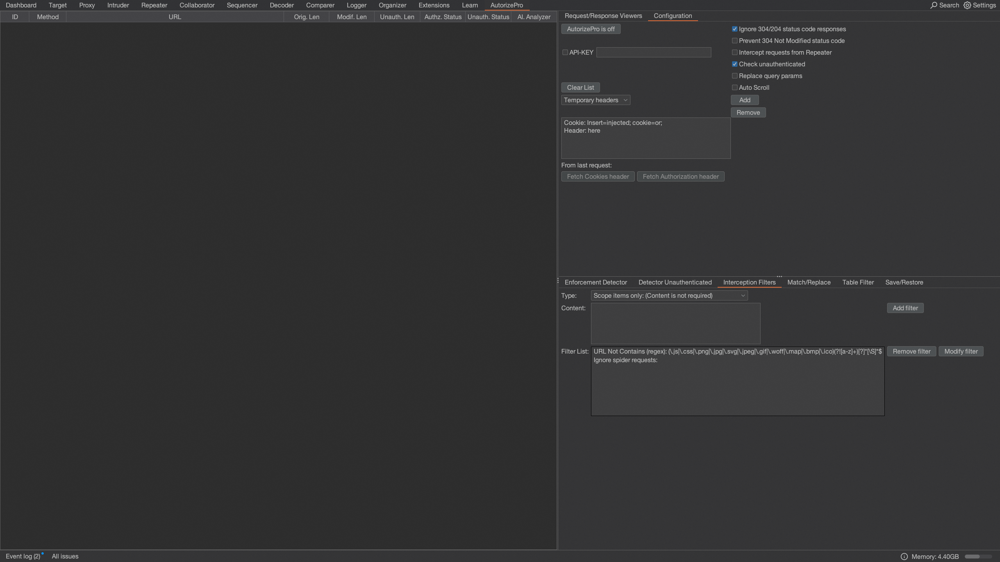
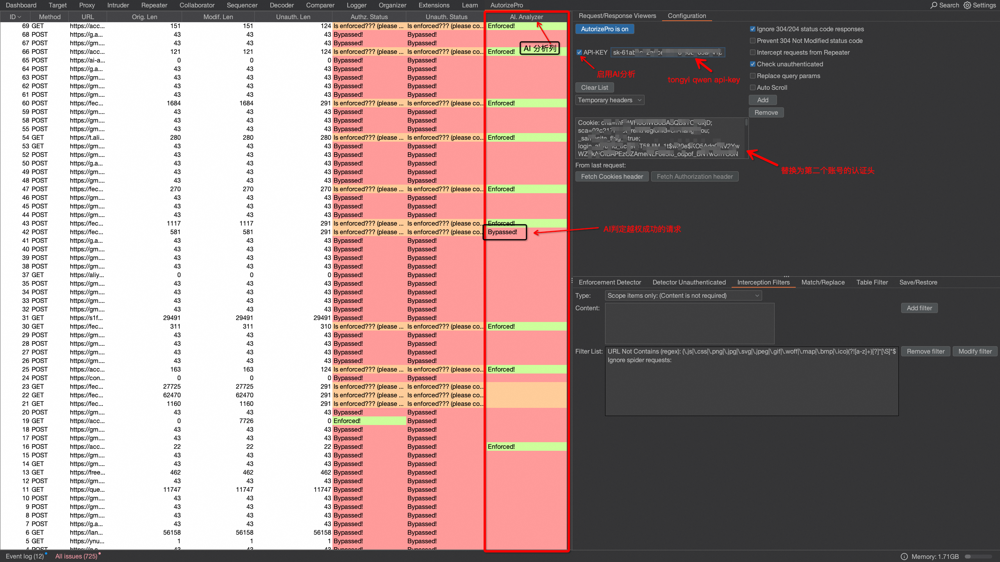
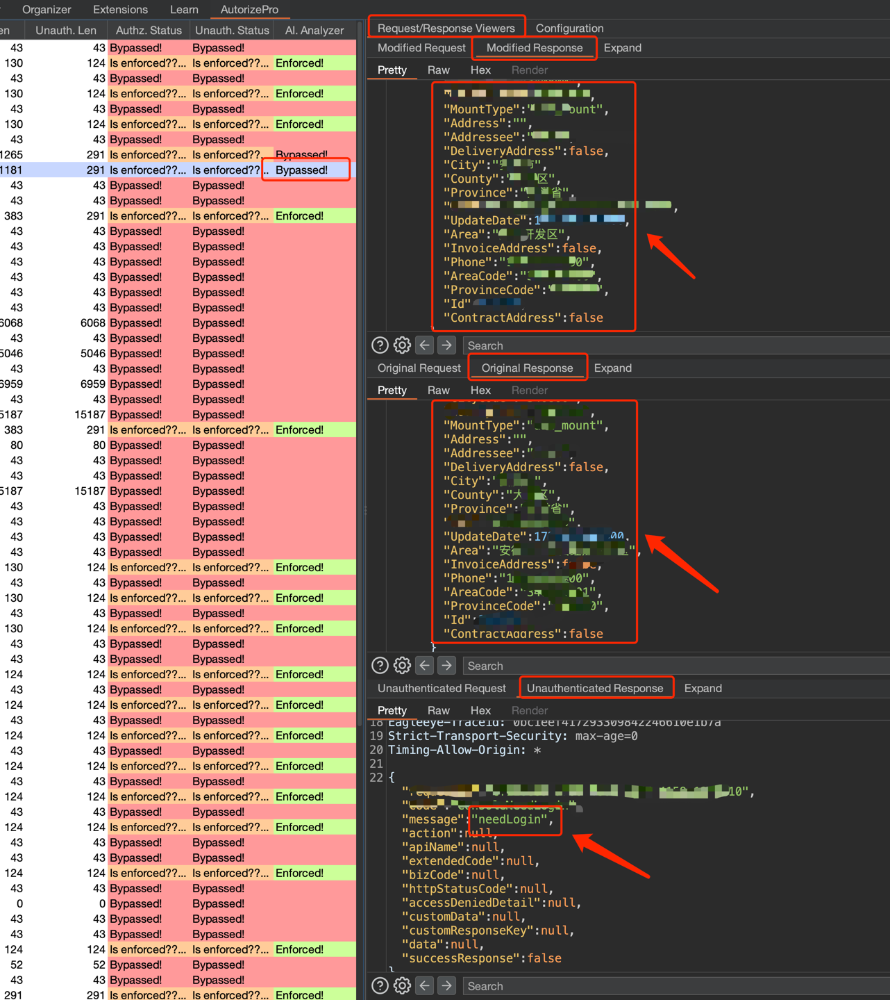

- [English README IS HERE](https://github.com/sule01u/AutorizePro/blob/master/README_en.md)

# 🧿 AutorizePro (AI分析模块上线啦 ❤️‍🔥): 点个🌟不迷路
### AutorizePro 是一款专注于越权检测的 Burp 插件，基于Autorize插件进行二次开发，方便安装易于使用 
> **⚠️ 未点击启用AI功能时走正常检测逻辑，AI为可选项。由于接口响应一般多种多样，启用AI分析会大幅提升检出准确率，强烈建议试试！！时间是宝贵的，我们应该尽量让AI来替我们做那些耗时且重复的工作。**

### 工具背景
- **越权漏洞在黑盒测试、SRC挖掘中几乎是必测的一项，但手工逐个测试越权漏洞往往会耗费大量时间，而自动化工具又存在大量误报, 基于此产生了AutorizePro**

### 工具亮点
- **优化检测逻辑 && 增加 AI 分析模块(可选项) ，将原始工具误报率从 99% 降低至 5% ，从海量误报中解脱出来**
- **对于需要人工确认的告警可通过展示页面并排查看 原始请求、越权请求 以及 未授权请求 的数据包方便对比差异**


## 🔧 安装AutorizePro
### 1️⃣ 下载 Burp Suite 和 Jython

    1. 下载 Burp Suite：https://portswigger.net/burp/releases
    2. 下载 Jython standalone JAR 文件：https://www.jython.org/download.html

### 2️⃣ 配置 Burp Suite 的 Python 环境

	1. 打开 Burp Suite
	2. 导航到 Extender -> Options
	3. 在 Python Environment 部分，点击 Select File
	4. 选择你刚刚下载的 Jython standalone JAR 文件 (本项目使用2.7.3版本测试)

### 3️⃣ 安装 AutorizePro 插件
	1. 下载插件到本地
    2. 打开 Burp Suite，导航到 Extender -> Extensions -> Add
    3. 在 Extension Type 选择框中，选择python
    4. 在 Extension file 选择框中，选择代码仓库中 AutorizePro.py 文件路径

### AutorizePro 插件安装完成界面 🎉

    
## 🔫 使用 AutorizePro 插件
    1. 打开配置选项卡：点击 AutorizePro -> Configuration。

    2. 通过fetch cookie header按钮获取最新请求的验证头 或 手动复制低权限用户的验证头（通常是 Cookie 或 Authorization），并将其复制到标有 “Insert injected header here” 的文本框中。注意：如果请求中已经包含了该头部，插件会替换现有的头部，否则会添加新头部。

    3. 如果不需要进行未授权的测试（即不带任何 cookie 的请求，用于检查接口是否存在身份验证，而不仅仅是低权限用户的越权检测），可以取消勾选 Check unauthenticated (默认开启)。

    4. 勾选 Intercept requests from Repeater，通过 Repeater 发送的请求也会被进行插件处理。

    5. 点击 AutorizePro is off 按钮启用插件，让 AutorizePro 开始拦截流量，并进行授权检测。

    6. 打开浏览器，并配置代理设置，使流量能够通过 Burp 代理。

    7. 使用高权限用户访问你想测试的应用程序，测试修改类资源时可使用 Match/Replace 配置越权测试时需要修改的资源信息。

    8. 在 AutorizePro 插件的左侧结果展示界面中，你将看到请求的 URL 和 对应的权限检查状态。
    
    9. 目前仅支持阿里云通义千问 api key(sk开头); 如何获取API-KEY: https://help.aliyun.com/zh/model-studio/developer-reference/get-api-key)。

    10. 当启用 API-Key 时，符合AI分析触发条件的请求会交由 AI 进一步分析，结果将展示在 AI. Analyzer 列。

    11. 点击左侧展示页面的某个 URL，可以查看它的原始请求、修改后的请求以及未经身份验证的请求/响应，方便你分辨差异。

###  🌠 使用效果示例
>  🌟 大幅降低误报: 从下图中可以看出，启用AI分析后，你只需要去分析一个请求是否真正越权，人工投入的分析精力节约95%以上。


> 查看AI判定越权的具体请求，可同时展示越权请求、原始请求、未授权请求，方便对比差异



### ❓检测状态说明
- **Bypassed! (红色) : 判定越权**

- **Enforced! (绿色) : 判定不存在越权**

- **Is enforced??? (please configure enforcement detector): 无法判断，可以在 enforcement detector 进一步配置越权特征协助判断**

```
🌟 Tips:

    Is enforced??? 状态表示插件无法确定接口是否做了权限控制，可通过 enforcement detector 进一步配置权限校验特征来辅助判断。

    eg:
    如果某个接口对于越权访问请求会返回 "无权限" 这个指纹特征，
    你就可以将这个指纹特征添加到 Enforcement Detector 过滤器中，这样插件判断时就会查找这个指纹特征，区分出实际已鉴权的接口，减少误报。
```

### 🚰 过滤器配置：在 Interception Filters 配置拦截规则

- **拦截过滤器位可以配置插件需要拦截哪些域名 或 拦截带有什么特征的请求。**
- **你可以通过黑名单、白名单、正则表达式或 Burp 的范围内的项目来确定拦截的范围，以避免不必要的域名被 AutorizePro 拦截，减少对不关注的请求的拦截分析。**
- **🌟 默认配置会避免拦截脚本和图片，你也可以新增更多静态资源类型的忽略规则。**

##  💰 AI分析功能需要花多少钱？(默认根据工具检测逻辑判断，AI需要用户启用之后才会生效)
- 为最大程度减少AI分析带来的经费消耗,启用AI分析之后仅自动检测 状态码相等 && 响应为json格式 && 长度小于3000 的数据包;若不符合条件，AI分析功能将不会生效。  
-  ⚠️ 注意：当启用AI分析功能时，您应该尽量在 Interception Filters 中配置拦截的 域名 / 规则 以免检测非目标站点带来的经费消耗。
- AI分析功能需要先开通模型调用服务，在 [阿里云百炼首页顶部提示](https://bailian.console.aliyun.com/#/home) 进行开通：

- [阿里云通义千问API计费说明](https://help.aliyun.com/zh/model-studio/billing-for-model-studio) ( 个人测试消耗示例：在插件开发调试期间全天较高频率测试且没有限制域名，全天消耗总费用**0.38元**，实际上线采用的模型成本减半，速度更快)
<p>
    
</p>

## ⛪ Discussion
* Bug 反馈或新功能建议[点我](https://github.com/sule01u/AutorizePro/issues)
* 欢迎PR
* 微信公众号: **扫码关注不懂安全获取更多安全分享**
<p>
    
</p>


##  🤗 鸣谢
**本产品基于 [Autorize](https://github.com/Quitten/Autorize) 插件开发，感谢 Barak Tawily。**

## 📑 Licenses

在原有协议基础之上追加以下免责声明。若与原有协议冲突均以免责声明为准。

<u>在使用本工具进行检测时，您应确保该行为符合当地的法律法规，并且已经取得了足够的授权。 禁止用于未经授权的渗透测试，禁止二次开发后进行未经授权的渗透测试。

如您在使用本工具的过程中存在任何非法行为，您需自行承担相应后果，开发者将不承担任何法律及连带责任。</u> 

在使用本工具前，请您务必审慎阅读、充分理解各条款内容，限制、免责条款或者其他涉及您重大权益的条款可能会以加粗、加下划线等形式提示您重点注意。 除非您已充分阅读、完全理解并接受本协议所有条款，否则，请您不要使用本工具。您的使用行为或者您以其他任何明示或者默示方式表示接受本协议的，即视为您已阅读并同意本协议的约束。
